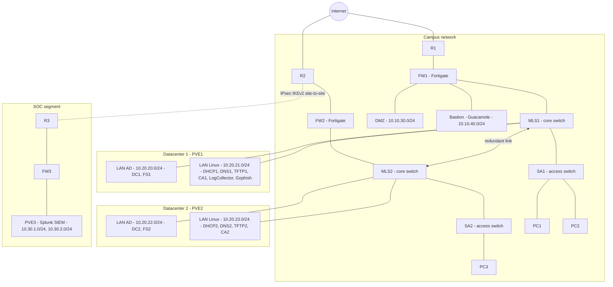

# SOC Detection Validation Lab

## 1. Context and Objective

This project was built during a SOC/CSIRT-oriented training program (Play-Zone 2025) to address a recurring problem in security operations: detection use cases degrade silently over time as systems, log sources, and configurations drift, and validating them manually is slow and inconsistent.

The objective was to build a controlled, segmented lab environment that reproduces a realistic enterprise network, generate and replay real attack logs against it, and continuously validate that a Splunk SIEM's detection use cases still fire as expected. The goal was to turn ad hoc use case testing into a repeatable, semi-automated process.

Main requirements:
- Speed up use case testing and SOC reactivity through regular, reproducible, automated tests
- Automate attack scenario execution based on real logs to validate use case effectiveness
- Generate and replay attack logs in a controlled way to test and guarantee detection capability

## 2. Architecture

The lab reproduces a segmented enterprise network with two redundant datacenter sites and a dedicated, isolated SOC segment reachable only through a site-to-site VPN tunnel.

Design principles:
- **Segmentation**: management, user, guest, DMZ and bastion traffic are isolated in dedicated VLANs (10, 100, 200, plus dedicated DMZ/bastion segments)
- **Redundancy**: network gear, servers, and datacenter hosts are deployed in pairs (except the SOC segment, which intentionally runs on a single router/firewall/host)
- **Isolation**: the SOC segment is only reachable through an IPsec IKEv2 site-to-site tunnel between the campus and SOC routers. Logs are the only traffic crossing that boundary
- **Centralized remote access**: a Guacamole bastion behind a Fortigate VPN gateway is the single entry point for SSH/RDP access to internal servers and network devices, so no device port is exposed directly

See [docs/architecture.md](docs/architecture.md) for the detailed client-to-site VPN, per-site datacenter, and log flow diagrams.

## 3. Technologies Used

- **SIEM**: Splunk Enterprise 9.3.1 (version pinned to match a target production environment), Rocky Linux 9.6
- **Log collection**: Splunk Universal Forwarders, rsyslog log collector
- **Automation**: Ansible (Universal Forwarder deployment and configuration)
- **Network security**: Fortigate 60F firewalls, pfSense virtual firewalls, IPsec IKEv2 (site-to-site and client-to-site), extended ACLs
- **Identity**: Windows Server Active Directory, internal 2-tier CA hierarchy
- **Remote access**: Guacamole bastion
- **Virtualization**: Proxmox VE
- **Offensive tooling (validation tests)**: Hydra, Nmap
- **Custom tooling**: UCT4S (Use Case Tester for Splunk), an internal tool for log injection and use case validation
- **CI/CD (planned)**: Forgejo pipeline for automated use case regression testing

## 4. Implementation

### 4.1 Infrastructure
The network was segmented into VLANs (Management 10, User 100, Guest 200), a DMZ, and a bastion segment, all filtered through Fortigate firewalls acting also as routers. Multi-layer switches (MLS1/MLS2) handle inter-VLAN routing and floating routes tied to IP SLA tracking for automatic failover. Every network device and server role (DC, FS, DNS, DHCP) is duplicated across two Proxmox hosts (PVE1/PVE2) to remove single points of failure; the SOC segment (router, firewall, Splunk host) is intentionally single-instance.

### 4.2 Log collection
Splunk Universal Forwarders were deployed with Ansible on Rocky Linux hosts to automate installation and configuration. Network device logs (routers, switches, firewalls) are centralized on a dedicated rsyslog collector, then forwarded to Splunk via Universal Forwarders, which also perform log pre-parsing before ingestion.

### 4.3 Collection architecture evaluation
Before settling on a Universal-Forwarder-based architecture, more advanced collection/normalization tools (Cribl, Splunk Connect for Syslog) were evaluated. They offer stronger filtering, normalization, and volume control, but bring configuration and maintenance overhead that didn't fit the project's time constraints. Secured syslog over TCP 6514 (TLS) was identified as a follow-up improvement but not implemented in this MVP. Universal Forwarders were chosen as the pragmatic path to a working SIEM within the available time, with the option to migrate to Cribl/SC4S later.

### 4.4 Use case validation approach
Splunk's official `contentctl` tool was evaluated for use case validation. It is built to test detections *before* they reach production (dataset generation, detection modeling, CI/CD for new use cases), not to diagnose whether detections already deployed in Splunk still fire correctly, which was the actual need here. Using it purely for that purpose would have meant a disproportionate setup cost for a low return.

Instead, a custom tool, **UCT4S (Use Case Tester for Splunk)**, was designed to inject synthetic logs, run the associated SPL searches, and continuously validate detection use cases. The goal is to eventually trigger that validation automatically from a Forgejo CI/CD pipeline on every use case change.

### 4.5 Validation tests

**Brute force (Hydra)**: targeted the Active Directory domain controller's LDAP authentication to check whether Splunk correctly detects and correlates repeated failed logon attempts. A custom username list and a common-pattern password list were used; the goal was to observe AD's lockout/delay behavior and SIEM detection effectiveness, not to compromise accounts. No destructive or unauthorized testing was performed.

**Reconnaissance scan (Nmap)**: horizontal and vertical scans against the domain controller to enumerate open ports, active hosts, and service versions (confirming LDAP on 389/TCP), and to verify that the resulting Windows Filtering Platform events were logged in AD and forwarded to Splunk in correlation with the generated alert.

## 5. Measurable Results

- The Hydra brute-force test against the domain controller generated Windows Security event **4625** (failed logon) for each attempt; these events were correctly forwarded to Splunk and detected as anomalous authentication behavior.
- The Nmap scan against the domain controller generated Windows Security event **5156** (Windows Filtering Platform connection permitted) on port 389/TCP; these events were correctly forwarded to Splunk and correlated with the expected alert.
- Anonymized samples of both events are available in [logs-samples/](logs-samples/).

Quantitative metrics (mean time to detect, detection rate across the full use case catalog) were not formally measured during this phase and are not reported here. Validation was qualitative: did the expected event fire and reach Splunk, yes or no. See [docs/results.md](docs/results.md) for the full breakdown.

## 6. Lessons Learned

- **Traffic segregation vs. reliability**: the original design tried to keep SOC management traffic and log traffic on separate paths, with part of that traffic routed outside the VPN tunnel. This created a risk of losing logs if they were routed outside the tunnel. The decision was made to route all SOC-bound traffic through the VPN instead: slightly less granular, but simpler routing (via VTI), more reliable log delivery, and a smaller attack surface.
- **`monitor://` stanza misconception**: Splunk rejected a Universal Forwarder `monitor://` stanza using `recursive=true` (`Invalid key: recursive=true`). That attribute isn't supported in UF monitor stanzas, and Splunk does not recurse into subdirectories automatically. Fixed by adjusting the monitored paths explicitly.
- **`systemctl status` not showing `User=splunkfwd`**: initially read as a misconfiguration, but this is normal. `systemd` doesn't always print every internal directive in `systemctl status` output. The service was running correctly despite the missing line.
- **Tool selection under time constraints**: `contentctl` and advanced collectors (Cribl, SC4S) were both evaluated and deliberately deferred, not because they are inferior but because their setup cost didn't match the project's timeline and actual need (validating already-deployed detections, not authoring new ones). Documenting *why* a mainstream tool was not used is treated as being as important as documenting what was implemented.
