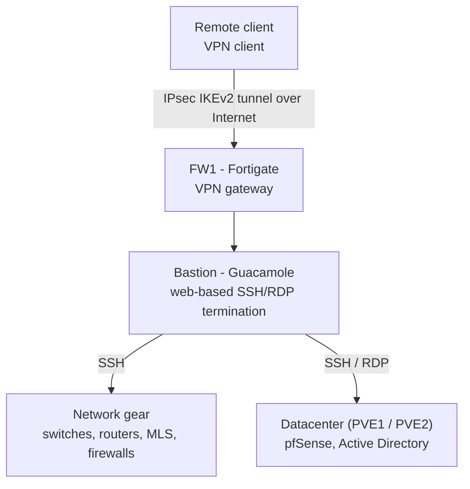
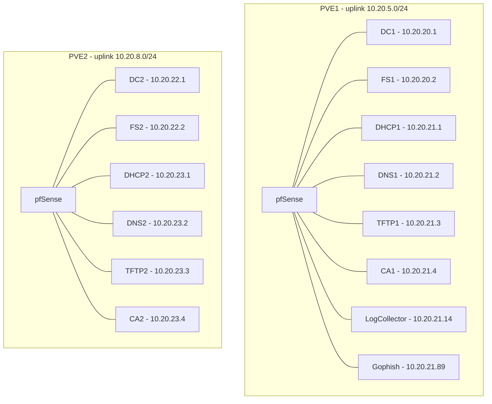
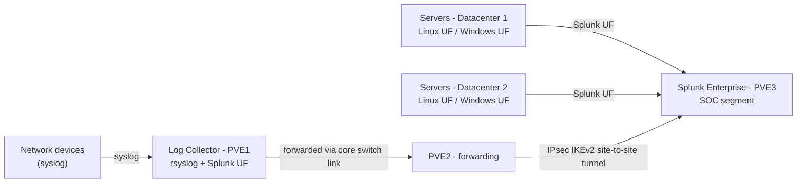

# Architecture Detail

All addressing below is anonymized: real network prefixes were replaced with generic ranges (`10.x.x.x`) and internal domains were replaced with `*.example.lab`. Host suffixes, VLAN IDs, and the overall segmentation logic are kept identical to the original design, since that structure, not the specific IPs, is what matters technically.

> **MVP scope note (kept from the original documentation):** this architecture was intentionally limited to its functional perimeter. Splunk Connect for Syslog (SC4S), Cribl, and secured syslog over TCP 6514 (TLS) were identified as possible improvements but not implemented, due to time constraints. The architecture was designed to allow that evolution later.

## Remote access: Client-to-Site VPN and Bastion

The bastion is the single entry point for administrative access: no network device or server port is exposed directly. A remote administrator connects over an IPsec tunnel to the Fortigate VPN gateway, then reaches the Guacamole web portal, which brokers SSH/RDP sessions to the target systems without giving the client direct network-layer access to them.

## Per-site datacenter layout (Proxmox)

Both datacenter sites follow the same pattern: a pfSense virtual firewall fronts two segments: an Active Directory segment and a Linux services segment. Site 2 mirrors site 1 for redundancy, except for the log collector and the phishing-simulation host, which only exist on site 1.

- Active Directory domain: `ad.example.lab` (DC1/DC2 are domain controllers, FS1/FS2 are file servers)
- Certificate hierarchy: CA1 (site 1) is the offline root CA; CA2 (site 2) is the intermediate CA that signs certificates for network hosts
- `Gophish` is deployed and functional but is not used in this phase of the project (reserved for future phishing-awareness scenarios)

## Log flow

Two collection paths converge on Splunk:
1. **Network device logs** (routers, switches, firewalls) are sent via syslog to a dedicated Log Collector on site 1, which also runs a Splunk Universal Forwarder. From there, logs are relayed through site 2 and cross the IPsec site-to-site tunnel into the SOC segment.
2. **Server logs** (Windows and Linux hosts on both datacenter sites) are sent directly to Splunk through their own Universal Forwarders.

This keeps the SOC segment's only inbound path a single, encrypted, monitored tunnel, consistent with the isolation principle described in the main [README](../README.md).
